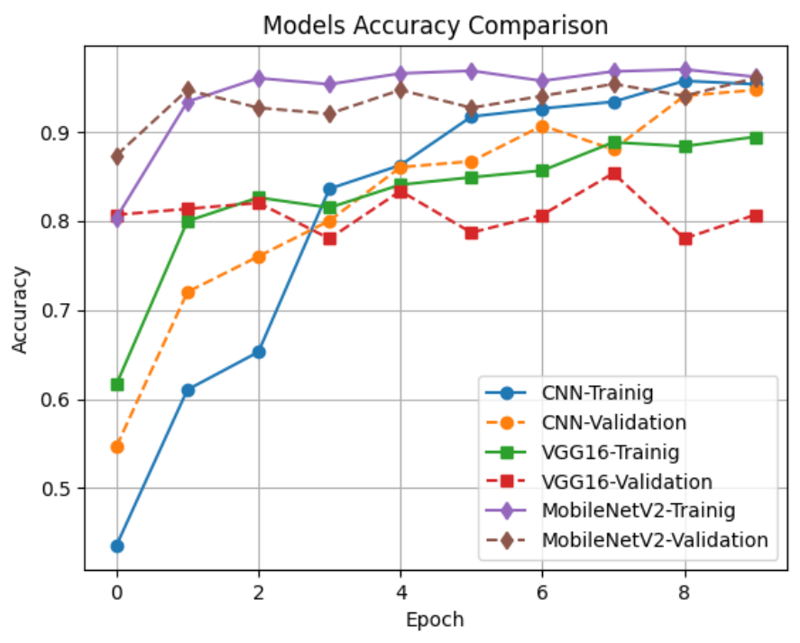
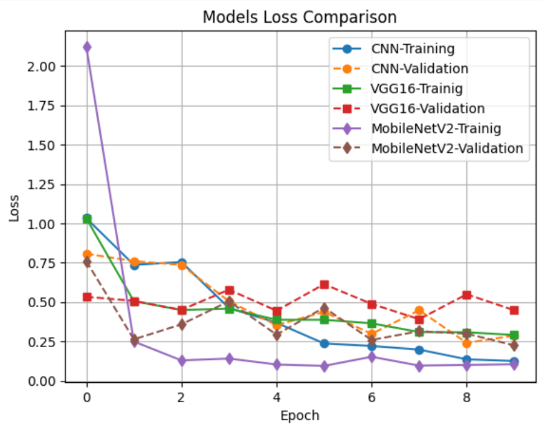
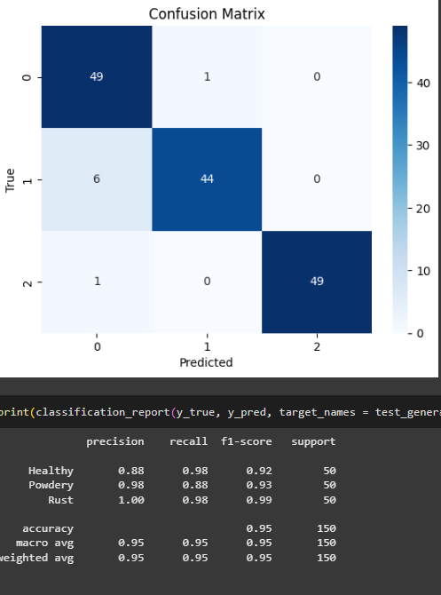
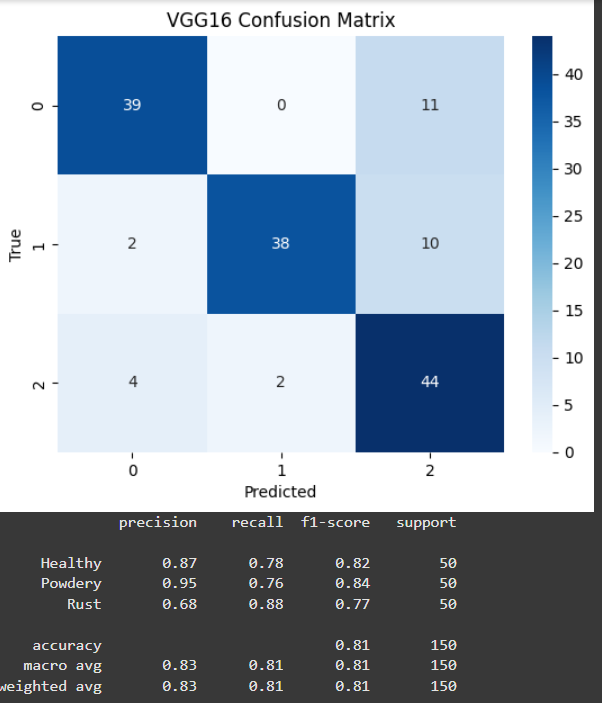
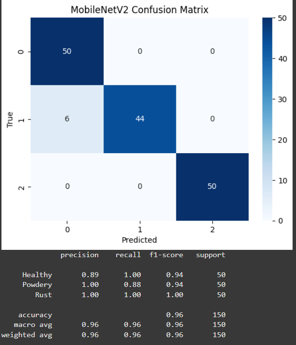

# 🌱 Plant Disease Classification using CNN and Transfer Learning

This project implements plant disease recognition using deep learning. It compares a Custom CNN, VGG16, and MobileNetV2 on the [Plant Disease Recognition Dataset](https://www.kaggle.com/datasets/rashikrahmanpritom/plant-disease-recognition-dataset).

The models are trained and evaluated on three categories of plant diseases using TensorFlow/Keras with data augmentation, transfer learning, and performance comparison.

## 📂 Dataset

The dataset is organized into three splits:

  - Train → /Train/Train
  
  - Validation → /Validation/Validation
  
  - Test → /Test/Test

Each folder contains subdirectories representing the different disease classes.
Source: [Plant Disease Recognition Dataset on Kaggle](https://www.kaggle.com/datasets/rashikrahmanpritom/plant-disease-recognition-dataset).

## ⚙️ Project Workflow

1. Data Preprocessing

   - Rescaling images (1./255)
    
   - Augmentations: horizontal flip, zoom, shear, rotation
    
   - Image size: 128x128, batch size 32
    
2. Models Implemented

   - Custom CNN (5 Conv2D + Dense layers)
    
   - VGG16 (transfer learning with frozen base)
    
   - MobileNetV2 (transfer learning with frozen base)

3. Evaluation

   - Confusion Matrix

   - Classification Report (Precision, Recall, F1-score)

   - Accuracy and Loss plots across epochs

   - Model comparison graphs
  
## 📊 Results
#### Custom CNN

   - Achieved baseline accuracy ~ 0.9419% .

#### VGG16 (Transfer Learning)

   - Achieved accuracy ~ 0.8067% .

#### MobileNetV2 (Transfer Learning)

   - Achieved accuracy ~ 0.9624% .

#### Model Comparison

- Graphs included in notebook:

   - Training vs Validation Accuracy
    
   - Training vs Validation Loss
    
   - Confusion Matrices
    
   - Precision, Recall, F1-score per class
     
 **Accuracy Comparison** 

**Loss Comparison** 

**Custom 5Layer CNN Metrics** 

**VGG-16 Metrics** 

**MobileNetV2 Metrics** 

## 🔮 Future Work

 - Fine-tune deeper layers of pre-trained models

 - Experiment with ResNet50, DenseNet201, and InceptionV3

 - Deploy the best model using Flask or FastAPI
